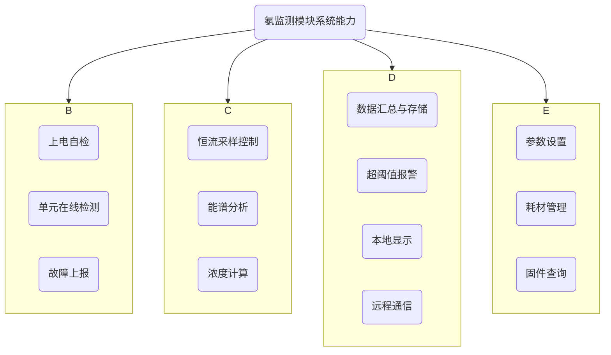

```mermaid
graph TD
    A(氡监测模块系统能力) --> B(自检与状态检测能力);
    A --> C(放射性浓度测量能力);
    A --> D(数据处理与交互能力);
A --> E(系统维护与测试能力);

    subgraph B
        B1(上电自检)
        B2(单元在线检测)
        B3(故障上报)
    end

    subgraph C
        C1(恒流采样控制);
        C2(能谱分析);
        C3(浓度计算);
    end

    subgraph D
        D1(数据汇总与存储);
        D2(超阈值报警);
        D3(本地显示);
        D4(远程通信);
    end

    subgraph E
        E1(参数设置);
        E2(耗材管理);
        E3(固件查询);
    end

```